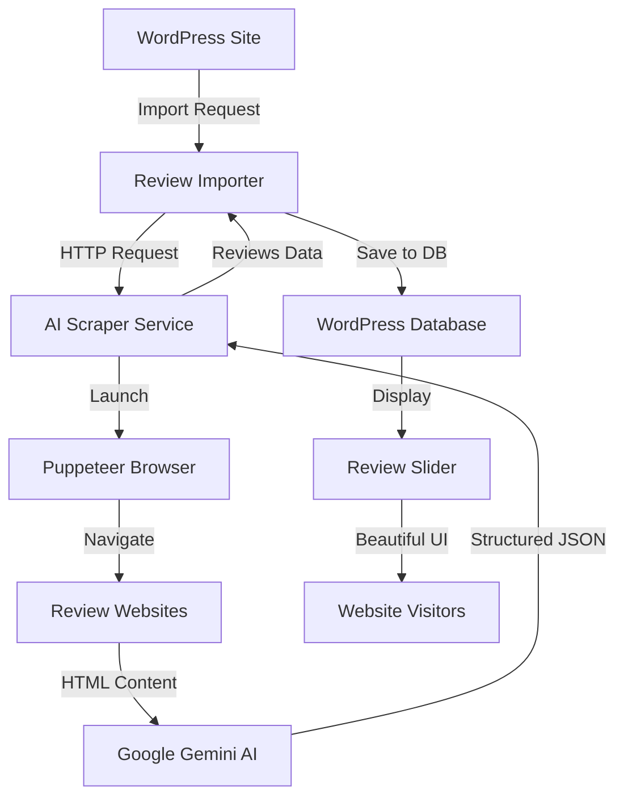

# 🌟 Social Review Slider - Complete Solution

[](https://wordpress.org/)
[](https://nodejs.org/)
[](https://www.gnu.org/licenses/gpl-2.0)
[](https://opensource.org/licenses/MIT)

A complete, production-ready solution for automatically scraping and displaying customer reviews from **Google Business**, **TripAdvisor**, and **Airbnb** on your WordPress website. This project combines a beautiful WordPress plugin with a powerful AI-driven scraper service.

## 📦 What's Included

This repository contains two main components:

### 1. **WordPress Plugin** - Social Review Slider
A beautiful, modern WordPress plugin that displays reviews in an elegant slider format.

### 2. **AI Scraper Service** - Review Scraper API
A 100% FREE Node.js service that automatically scrapes reviews using Google Gemini AI.

---

## ✨ Key Features

### WordPress Plugin Features

🎨 **Beautiful Design**
- Modern, premium card-based design
- Platform-specific color schemes (Google Blue, TripAdvisor Green, Airbnb Red)
- Smooth animations and transitions
- Fully responsive layout
- Dark mode support

⚙️ **Flexible Display Options**
- Random or chronological order
- Autoplay with customizable delay
- Configurable slides per view
- Navigation arrows and pagination dots
- Filter by specific platform or show all

🔧 **Easy to Use**
- Custom post type for reviews
- Simple meta boxes for review details
- Shortcode support with extensive parameters
- Widget support
- No coding required

🤖 **Automatic Import**
- Auto-fetch reviews from all platforms
- Scheduled imports (hourly, daily, weekly)
- Manual import on-demand
- Duplicate detection
- Import activity logging

### AI Scraper Service Features

🆓 **Completely Free**
- Uses Google Gemini API (no costs!)
- Save 100% on review scraping costs
- No expensive API subscriptions needed

🎯 **Multi-Platform Support**
- Google Business reviews
- TripAdvisor reviews
- Airbnb reviews
- Batch scraping from all platforms

🤖 **AI-Powered Intelligence**
- Google Gemini 2.0 Flash for data extraction
- Automatic fallback to OpenAI (optional)
- Adapts to website changes automatically
- Smart HTML parsing

🔒 **Production Ready**
- API key authentication
- Rate limiting (100 req/15min)
- Security headers with Helmet.js
- CORS protection
- Input validation

---

## 🚀 Quick Start

### Prerequisites

- **WordPress** 5.0 or higher
- **PHP** 7.0 or higher
- **Node.js** 18+ ([Download](https://nodejs.org/))
- **Google Gemini API Key** ([Get FREE key](https://aistudio.google.com/app/apikey))

### Installation Steps

#### Step 1: Install WordPress Plugin

1. **Upload the Plugin**
   ```bash
   # Copy the entire folder to WordPress plugins directory
   cp -r social-review-slider /path/to/wordpress/wp-content/plugins/
   ```

2. **Activate the Plugin**
   - Go to WordPress admin → Plugins
   - Find "Social Review Slider"
   - Click "Activate"

3. **You're Ready!**
   - A new "Reviews" menu will appear in your WordPress admin

#### Step 2: Setup AI Scraper Service

1. **Navigate to scraper service directory**
   ```bash
   cd scraper-service
   ```

2. **Install dependencies**
   ```bash
   npm install
   ```

3. **Get your FREE Gemini API Key**
   - Visit [Google AI Studio](https://aistudio.google.com/app/apikey)
   - Click "Create API key"
   - Copy the key (starts with `AIza...`)

4. **Configure environment**
   
   **Windows (Automated):**
   ```powershell
   .\configure-gemini.ps1
   ```
   
   **Manual Setup:**
   ```bash
   cp .env.example .env
   ```
   
   Edit `.env`:
   ```env
   # Google Gemini API (FREE!)
   GEMINI_API_KEY=AIza...your-key-here
   
   # API Security
   API_SECRET_KEY=your-secret-key-here
   PORT=3000
   NODE_ENV=production
   ```

5. **Start the service**
   ```bash
   npm start
   ```
   
   The service will be running at `http://localhost:3000` 🎉

6. **Verify it's working**
   ```bash
   # Test Gemini integration
   node test-gemini.js
   
   # Check service health
   curl http://localhost:3000/health
   ```

#### Step 3: Connect WordPress to Scraper Service

1. **Go to WordPress Admin**
   - Navigate to **Reviews → Import Settings**

2. **Configure Scraper Service**
   - **Service URL**: `http://localhost:3000` (or your deployed URL)
   - **API Secret Key**: Your configured secret key from `.env`

3. **Configure Platform URLs**
   - **Google Business URL**: Your Google Maps place URL
   - **TripAdvisor URL**: Your TripAdvisor listing URL
   - **Airbnb URL**: Your Airbnb listing URL

4. **Set Import Schedule**
   - Enable "Auto Import"
   - Choose frequency (Daily recommended)
   - Set import limit (50 reviews default)
   - Save changes

5. **Run First Import**
   - Click "Import Reviews Now" button
   - Wait for completion
   - Check "Recent Import Activity"

---

## 📖 Documentation

### WordPress Plugin Documentation

#### Using Shortcodes

Add this shortcode to any page, post, or widget:

```
[social_reviews]
```

**Available Parameters:**

```
[social_reviews 
    platform="all"           // Options: all, tripadvisor, google, airbnb
    count="-1"              // Number of reviews (-1 for all)
    autoplay="true"         // Enable autoplay (true/false)
    autoplay_delay="5000"   // Delay in milliseconds
    loop="true"             // Loop slides (true/false)
    slides_per_view="1"     // Number of slides visible
    space_between="30"      // Space between slides in pixels
    show_navigation="true"  // Show arrow buttons (true/false)
    show_pagination="true"  // Show pagination dots (true/false)
    random="true"           // Random order (true/false)
]
```

**Examples:**

Show only Google reviews:
```
[social_reviews platform="google"]
```

Show 5 random reviews with autoplay:
```
[social_reviews count="5" random="true" autoplay="true"]
```

Show 3 slides at once (great for desktop):
```
[social_reviews slides_per_view="3" space_between="20"]
```

#### Using Widgets

1. Go to **Appearance → Widgets**
2. Find **Social Review Slider** widget
3. Drag it to your desired widget area
4. Configure the settings
5. Save

#### Adding Reviews Manually

1. **Go to Reviews → Add New**
2. **Fill in the review details:**
   - **Title**: A brief title for the review (for admin reference)
   - **Content**: The actual review text
   - **Reviewer Name**: Name of the person who left the review
   - **Rating**: Select rating from 1 to 5 stars (supports half stars)
   - **Review Date**: When the review was posted
   - **Review URL**: Link to the original review
   - **Reviewer Location**: Where the reviewer is from
   - **Reviewer Avatar**: Upload a profile picture (optional)
   - **Platform**: Select TripAdvisor, Google, or Airbnb
3. **Publish** the review

### AI Scraper Service Documentation

#### API Endpoints

**Health Check**
```http
GET /health
```

**Scrape Google Reviews**
```http
POST /api/scrape/google
Headers: X-API-Key: your-secret-key
Body: {
  "placeUrl": "https://www.google.com/maps/place/...",
  "maxReviews": 50
}
```

**Scrape TripAdvisor Reviews**
```http
POST /api/scrape/tripadvisor
Headers: X-API-Key: your-secret-key
Body: {
  "hotelUrl": "https://www.tripadvisor.com/Hotel_Review-...",
  "maxReviews": 50
}
```

**Scrape Airbnb Reviews**
```http
POST /api/scrape/airbnb
Headers: X-API-Key: your-secret-key
Body: {
  "listingUrl": "https://www.airbnb.com/rooms/12345678",
  "maxReviews": 50
}
```

**Batch Scrape All Platforms**
```http
POST /api/scrape/all
Headers: X-API-Key: your-secret-key
Body: {
  "googleUrl": "https://www.google.com/maps/place/...",
  "tripadvisorUrl": "https://www.tripadvisor.com/Hotel_Review-...",
  "airbnbUrl": "https://www.airbnb.com/rooms/12345678",
  "maxReviews": 50
}
```

For complete API documentation, see [scraper-service/README.md](scraper-service/README.md)

---

## 📁 Project Structure

```
socialEmbed/
├── social-review-slider.php          # Main WordPress plugin file
├── includes/                          # WordPress plugin classes
│   ├── class-review-post-type.php    # Custom post type
│   ├── class-review-meta-boxes.php   # Meta boxes for review details
│   ├── class-review-shortcode.php    # Shortcode functionality
│   ├── class-review-widget.php       # Widget functionality
│   └── class-review-importer.php     # Auto-import functionality
├── assets/                            # WordPress plugin assets
│   ├── css/
│   │   ├── styles.css                # Frontend styles
│   │   └── admin-styles.css          # Admin styles
│   └── js/
│       ├── scripts.js                # Frontend scripts
│       └── admin-scripts.js          # Admin scripts
├── scraper-service/                   # AI Scraper Service (Node.js)
│   ├── server.js                     # Express server
│   ├── scrapers/                     # Platform-specific scrapers
│   │   ├── google-scraper.js
│   │   ├── tripadvisor-scraper.js
│   │   └── airbnb-scraper.js
│   ├── utils/                        # Utility functions
│   ├── .env.example                  # Environment template
│   ├── package.json                  # Node.js dependencies
│   └── README.md                     # Detailed scraper docs
├── doc/                               # Additional documentation
│   ├── README.md                     # WordPress plugin docs
│   └── API-SETUP-GUIDE.md           # API setup guide
├── demo.html                          # Demo page
└── README.md                          # This file
```

---

## 💰 Cost Comparison

| Solution | Cost per Review | Monthly (10k reviews) | Status |
|----------|----------------|----------------------|--------|
| **This Solution (Gemini)** | **$0.00** | **$0.00** | ✅ **FREE** |
| OpenAI GPT-4o-mini | $0.0001 | ~$1-2 | Optional Fallback |
| Google Places API | $0.017 | $170 | ❌ Expensive |
| TripAdvisor API | Varies | $100+ | ❌ Expensive |
| Commercial Scrapers | $0.01+ | $100+ | ❌ Expensive |

**Save 100% on review scraping costs!** 🎉

---

## 🛠️ How It Works



### Process Flow

1. **WordPress triggers import** (manual or scheduled)
2. **Scraper service receives request** with platform URLs
3. **Puppeteer launches headless browser** and navigates to review pages
4. **HTML content is extracted** from the page
5. **Google Gemini AI parses** the HTML and extracts structured review data
6. **Clean JSON data is returned** to WordPress
7. **WordPress saves reviews** to database with duplicate detection
8. **Reviews are displayed** in beautiful sliders on your site

---

## 🚀 Deployment

### Deploy Scraper Service

#### Option 1: Local Server / VPS

```bash
# Install PM2 for process management
npm install -g pm2

# Navigate to scraper service
cd scraper-service

# Start service with PM2
pm2 start server.js --name review-scraper

# Save PM2 configuration
pm2 save

# Setup auto-start on boot
pm2 startup
```

#### Option 2: Docker

```bash
cd scraper-service

# Build image
docker build -t review-scraper .

# Run container
docker run -d -p 3000:3000 \
  -e GEMINI_API_KEY=your-key \
  -e API_SECRET_KEY=your-secret \
  --name review-scraper \
  review-scraper
```

#### Option 3: Cloud Platforms

**Heroku:**
```bash
cd scraper-service
heroku create your-app-name
heroku config:set GEMINI_API_KEY=your-key
heroku config:set API_SECRET_KEY=your-secret
git push heroku main
```

**Railway / DigitalOcean / Render:**
- Connect your GitHub repository
- Add environment variables in dashboard
- Deploy automatically

### WordPress Plugin

Simply upload to your WordPress site's `wp-content/plugins/` directory and activate.

---

## 🔧 Configuration

### Environment Variables (Scraper Service)

| Variable | Required | Default | Description |
|----------|----------|---------|-------------|
| `GEMINI_API_KEY` | ✅ Yes | - | Google Gemini API key (FREE) |
| `API_SECRET_KEY` | ✅ Yes | - | Secret key for API authentication |
| `PORT` | No | 3000 | Server port |
| `NODE_ENV` | No | development | Environment (development/production) |
| `OPENAI_API_KEY` | No | - | OpenAI key for fallback (optional) |
| `RATE_LIMIT_WINDOW_MS` | No | 900000 | Rate limit window (15 min) |
| `RATE_LIMIT_MAX_REQUESTS` | No | 100 | Max requests per window |
| `HEADLESS_MODE` | No | true | Run browser in headless mode |
| `TIMEOUT_MS` | No | 30000 | Request timeout (30 sec) |

### WordPress Plugin Settings

Configure in **WordPress Admin → Reviews → Import Settings**:

- **Scraper Service URL**: URL where your scraper service is running
- **API Secret Key**: Must match the scraper service configuration
- **Platform URLs**: Your Google, TripAdvisor, and Airbnb listing URLs
- **Import Schedule**: Frequency of automatic imports
- **Import Limit**: Maximum number of reviews to import per run

---

## 🐛 Troubleshooting

### Common Issues

#### WordPress Plugin

**Reviews not displaying:**
- Check if reviews are published (not drafts)
- Verify shortcode syntax is correct
- Clear WordPress cache
- Check browser console for JavaScript errors

**Import not working:**
- Verify scraper service is running (`curl http://localhost:3000/health`)
- Check API secret key matches in both WordPress and scraper service
- Review import logs in WordPress admin
- Ensure URLs are correct and accessible

#### Scraper Service

**"Browser launch failed":**
```bash
# Ubuntu/Debian
sudo apt-get install -y chromium-browser

# Or use Puppeteer's bundled Chromium (already included)
```

**"AI API error" or "Gemini not responding":**
- Verify API key at [Google AI Studio](https://aistudio.google.com/app/apikey)
- Check rate limits (15 requests/minute on free tier)
- Ensure internet connection is stable
- Run diagnostic: `node diagnose-api.js`

**"Timeout errors":**
- Increase `TIMEOUT_MS` in `.env` (e.g., `60000` for 60 seconds)
- Check internet connection speed
- Some websites have anti-bot measures

### Debug Mode

Enable detailed logging:

```bash
# Scraper service
cd scraper-service
NODE_ENV=development npm start

# Check logs
tail -f logs/app.log
```

### Testing Tools

```bash
cd scraper-service

# Test Gemini API connection
node test-gemini.js

# Test actual scraping
node test-scrape.js

# Diagnose API issues
node diagnose-api.js

# Check service health
curl http://localhost:3000/health
```

---

## 📈 Performance

- **Average scraping time**: 10-30 seconds per platform
- **Concurrent requests**: Supported with rate limiting
- **Memory usage**: ~200-300MB per browser instance
- **Success rate**: ~95% (depends on website stability)
- **Rate limits**: 100 requests per 15 minutes (configurable)

---

## 🔒 Security

### Scraper Service
- ✅ API Key Authentication
- ✅ Rate Limiting (100 req/15min)
- ✅ Helmet.js Security Headers
- ✅ CORS Protection
- ✅ Input Validation
- ✅ Environment Variables for credentials

### WordPress Plugin
- ✅ WordPress Nonces for AJAX
- ✅ Capability Checks
- ✅ Sanitized Inputs
- ✅ Escaped Outputs
- ✅ Secure API Communication

---

## 📚 Additional Resources

- **WordPress Plugin Docs**: [doc/README.md](doc/README.md)
- **Scraper Service Docs**: [scraper-service/README.md](scraper-service/README.md)
- **API Setup Guide**: [doc/API-SETUP-GUIDE.md](doc/API-SETUP-GUIDE.md)
- **Contributing Guide**: [scraper-service/CONTRIBUTING.md](scraper-service/CONTRIBUTING.md)
- **Changelog**: [scraper-service/CHANGELOG.md](scraper-service/CHANGELOG.md)

---

## 🤝 Contributing

Contributions are welcome! Please follow these steps:

1. Fork the repository
2. Create a feature branch (`git checkout -b feature/amazing-feature`)
3. Commit your changes (`git commit -m 'Add amazing feature'`)
4. Push to the branch (`git push origin feature/amazing-feature`)
5. Open a Pull Request

---

## 📄 License

- **WordPress Plugin**: GPL v2 or later
- **AI Scraper Service**: MIT License

---

## 🙏 Acknowledgments

- [Google Gemini AI](https://ai.google.dev/) - Free AI API
- [Puppeteer](https://pptr.dev/) - Headless browser automation
- [Express.js](https://expressjs.com/) - Web framework
- [Swiper.js](https://swiperjs.com/) - Slider functionality
- [WordPress](https://wordpress.org/) - CMS platform

---

## 📞 Support

- **Issues**: [GitHub Issues](https://github.com/yourusername/social-review-slider/issues)
- **Discussions**: [GitHub Discussions](https://github.com/yourusername/social-review-slider/discussions)

---

## 🗺️ Roadmap

- [ ] Add support for Yelp reviews
- [ ] Add support for Facebook reviews
- [ ] Implement caching layer
- [ ] Add review sentiment analysis
- [ ] Create web dashboard for scraper service
- [ ] Add webhook notifications
- [ ] Support for review monitoring/alerts
- [ ] Gutenberg block for WordPress
- [ ] Elementor widget support

---

## ⭐ Star History

If you find this project useful, please consider giving it a star! ⭐

---

<div align="center">

**Made with ❤️ for hotels, restaurants, and businesses everywhere**

[Report Bug](https://github.com/yourusername/social-review-slider/issues) · [Request Feature](https://github.com/yourusername/social-review-slider/issues) · [Documentation](https://github.com/yourusername/social-review-slider/wiki)

**Enjoy using Social Review Slider! 🌟**

</div>
