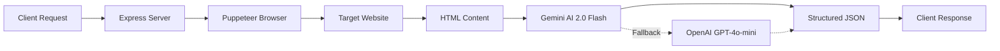

# 🤖 AI-Powered Review Scraper Service

[](https://opensource.org/licenses/MIT)
[](https://nodejs.org/)
[](https://ai.google.dev/)
[]()

A **100% FREE** Node.js service that intelligently scrapes customer reviews from Google Business, TripAdvisor, and Airbnb using Puppeteer and **Google Gemini AI** for data extraction.

## ✨ Features

- 🆓 **Completely Free** - Uses Google Gemini API (no costs!)
- 🎯 **Multi-Platform** - Supports Google, TripAdvisor, and Airbnb
- 🤖 **AI-Powered** - Intelligent data extraction with Gemini 2.0 Flash
- 🔒 **Secure** - API key authentication, rate limiting, and security headers
- ⚡ **Fast** - Concurrent scraping with optimized performance
- 🔄 **Resilient** - Automatic fallback to OpenAI (optional)
- 📊 **Structured Data** - Clean JSON output ready for integration
- 🚀 **Production Ready** - Built with Express.js and best practices

## 💰 Cost Comparison

| Provider | Cost per Review | Monthly (10k reviews) | Status |
|----------|----------------|----------------------|--------|
| **This Service (Gemini)** | **$0.00** | **$0.00** | ✅ **FREE** |
| OpenAI GPT-4o-mini | $0.0001 | ~$1-2 | Optional Fallback |
| Google Places API | $0.017 | $170 | ❌ Expensive |
| Commercial Scrapers | $0.01+ | $100+ | ❌ Expensive |

**Save 100% on review scraping costs!** 🎉

## 📋 Table of Contents

- [Quick Start](#-quick-start)
- [Installation](#-installation)
- [Configuration](#-configuration)
- [API Documentation](#-api-documentation)
- [Usage Examples](#-usage-examples)
- [How It Works](#-how-it-works)
- [WordPress Integration](#-wordpress-integration)
- [Deployment](#-deployment)
- [Troubleshooting](#-troubleshooting)
- [Contributing](#-contributing)
- [License](#-license)

## 🚀 Quick Start

```bash
# Clone the repository
git clone https://github.com/yourusername/ai-review-scraper.git
cd ai-review-scraper

# Install dependencies
npm install

# Configure with Gemini API (FREE)
# Windows PowerShell:
.\configure-gemini.ps1

# Or manually create .env file
cp .env.example .env
# Edit .env and add your Gemini API key

# Start the service
npm start
```

The service will be running at `http://localhost:3000` 🎉

## 📦 Installation

### Prerequisites

- **Node.js** 18+ ([Download](https://nodejs.org/))
- **Google Gemini API Key** ([Get FREE key](https://aistudio.google.com/app/apikey))
- **Chrome/Chromium** (for Puppeteer - auto-installed)

### Step-by-Step Setup

1. **Clone the repository**
   ```bash
   git clone https://github.com/yourusername/ai-review-scraper.git
   cd ai-review-scraper
   ```

2. **Install dependencies**
   ```bash
   npm install
   ```

3. **Get your FREE Gemini API Key**
   - Visit [Google AI Studio](https://aistudio.google.com/app/apikey)
   - Click "Create API key"
   - Copy the key (starts with `AIza...`)

4. **Configure environment**
   
   **Option A: Automated (Windows)**
   ```powershell
   .\configure-gemini.ps1
   ```
   
   **Option B: Manual**
   ```bash
   cp .env.example .env
   ```
   
   Edit `.env`:
   ```env
   # Google Gemini API (FREE!)
   GEMINI_API_KEY=AIza...your-key-here
   
   # API Security
   API_SECRET_KEY=your-secret-key-here
   PORT=3000
   NODE_ENV=production
   
   # Optional: OpenAI fallback (only if Gemini fails)
   # OPENAI_API_KEY=sk-your-openai-key-here
   ```

5. **Start the service**
   ```bash
   npm start
   ```

6. **Verify it's working**
   ```bash
   # Test Gemini integration
   node test-gemini.js
   
   # Check service health
   curl http://localhost:3000/health
   ```

## ⚙️ Configuration

### Environment Variables

| Variable | Required | Default | Description |
|----------|----------|---------|-------------|
| `GEMINI_API_KEY` | ✅ Yes | - | Google Gemini API key (FREE) |
| `API_SECRET_KEY` | ✅ Yes | - | Secret key for API authentication |
| `PORT` | No | 3000 | Server port |
| `NODE_ENV` | No | development | Environment (development/production) |
| `OPENAI_API_KEY` | No | - | OpenAI key for fallback (optional) |
| `RATE_LIMIT_WINDOW_MS` | No | 900000 | Rate limit window (15 min) |
| `RATE_LIMIT_MAX_REQUESTS` | No | 100 | Max requests per window |
| `HEADLESS_MODE` | No | true | Run browser in headless mode |
| `TIMEOUT_MS` | No | 30000 | Request timeout (30 sec) |

### Available Scripts

```bash
npm start          # Start production server
npm run dev        # Start with auto-reload (nodemon)
npm test           # Run tests
node test-gemini.js    # Test Gemini API integration
node test-scrape.js    # Test actual scraping
node diagnose-api.js   # Diagnose API key issues
```

## 📡 API Documentation

### Authentication

All API endpoints (except `/health`) require authentication via the `X-API-Key` header:

```bash
X-API-Key: your-secret-key-here
```

### Endpoints

#### 1. Health Check

```http
GET /health
```

**Response:**
```json
{
  "status": "ok",
  "service": "Review Scraper Service",
  "version": "1.0.0"
}
```

#### 2. Scrape Google Reviews

```http
POST /api/scrape/google
```

**Headers:**
```
X-API-Key: your-secret-key
Content-Type: application/json
```

**Request Body:**
```json
{
  "placeUrl": "https://www.google.com/maps/place/...",
  "maxReviews": 50
}
```

**Response:**
```json
{
  "success": true,
  "platform": "google",
  "count": 25,
  "reviews": [
    {
      "author_name": "John Doe",
      "rating": 5,
      "text": "Excellent service! Highly recommend.",
      "date": "2024-01-15",
      "platform": "google"
    }
  ]
}
```

#### 3. Scrape TripAdvisor Reviews

```http
POST /api/scrape/tripadvisor
```

**Request Body:**
```json
{
  "hotelUrl": "https://www.tripadvisor.com/Hotel_Review-...",
  "maxReviews": 50
}
```

#### 4. Scrape Airbnb Reviews

```http
POST /api/scrape/airbnb
```

**Request Body:**
```json
{
  "listingUrl": "https://www.airbnb.com/rooms/12345678",
  "maxReviews": 50
}
```

#### 5. Batch Scrape (All Platforms)

```http
POST /api/scrape/all
```

**Request Body:**
```json
{
  "googleUrl": "https://www.google.com/maps/place/...",
  "tripadvisorUrl": "https://www.tripadvisor.com/Hotel_Review-...",
  "airbnbUrl": "https://www.airbnb.com/rooms/12345678",
  "maxReviews": 50
}
```

**Response:**
```json
{
  "success": true,
  "platforms": {
    "google": {
      "success": true,
      "count": 25,
      "reviews": [...]
    },
    "tripadvisor": {
      "success": true,
      "count": 30,
      "reviews": [...]
    },
    "airbnb": {
      "success": true,
      "count": 20,
      "reviews": [...]
    }
  }
}
```

### Error Responses

```json
{
  "success": false,
  "error": "Error message here"
}
```

**Common HTTP Status Codes:**
- `200` - Success
- `400` - Bad Request (missing parameters)
- `401` - Unauthorized (invalid API key)
- `429` - Too Many Requests (rate limit exceeded)
- `500` - Internal Server Error

## 💡 Usage Examples

### cURL

```bash
# Scrape Google reviews
curl -X POST http://localhost:3000/api/scrape/google \
  -H "X-API-Key: your-secret-key" \
  -H "Content-Type: application/json" \
  -d '{
    "placeUrl": "https://www.google.com/maps/place/Statue+of+Liberty",
    "maxReviews": 50
  }'
```

### JavaScript (Node.js)

```javascript
const axios = require('axios');

async function scrapeReviews() {
  try {
    const response = await axios.post('http://localhost:3000/api/scrape/google', {
      placeUrl: 'https://www.google.com/maps/place/...',
      maxReviews: 50
    }, {
      headers: {
        'X-API-Key': 'your-secret-key',
        'Content-Type': 'application/json'
      }
    });
    
    console.log(`Scraped ${response.data.count} reviews`);
    console.log(response.data.reviews);
  } catch (error) {
    console.error('Error:', error.message);
  }
}

scrapeReviews();
```

### Python

```python
import requests

url = "http://localhost:3000/api/scrape/google"
headers = {
    "X-API-Key": "your-secret-key",
    "Content-Type": "application/json"
}
data = {
    "placeUrl": "https://www.google.com/maps/place/...",
    "maxReviews": 50
}

response = requests.post(url, json=data, headers=headers)
result = response.json()

print(f"Scraped {result['count']} reviews")
for review in result['reviews']:
    print(f"{review['author_name']}: {review['rating']}⭐ - {review['text']}")
```

### PHP

```php
<?php
$url = 'http://localhost:3000/api/scrape/google';
$data = [
    'placeUrl' => 'https://www.google.com/maps/place/...',
    'maxReviews' => 50
];

$options = [
    'http' => [
        'header'  => "Content-Type: application/json\r\n" .
                     "X-API-Key: your-secret-key\r\n",
        'method'  => 'POST',
        'content' => json_encode($data)
    ]
];

$context  = stream_context_create($options);
$result = file_get_contents($url, false, $context);
$reviews = json_decode($result, true);

echo "Scraped " . $reviews['count'] . " reviews\n";
print_r($reviews['reviews']);
?>
```

## 🛠️ How It Works



### Process Flow

1. **Request Received** - Client sends scraping request with URL
2. **Browser Launch** - Puppeteer launches headless Chrome
3. **Page Navigation** - Navigates to review page (Google/TripAdvisor/Airbnb)
4. **Content Loading** - Scrolls and clicks to load all reviews
5. **HTML Extraction** - Extracts raw HTML content
6. **AI Processing** - Google Gemini 2.0 Flash parses HTML and extracts structured data
7. **Fallback (Optional)** - If Gemini fails, falls back to OpenAI
8. **Data Validation** - Validates and normalizes review data
9. **JSON Response** - Returns clean, structured JSON

### Why Gemini AI?

- ✅ **100% Free** - No API costs
- ✅ **Smart Parsing** - Understands complex HTML structures
- ✅ **Resilient** - Adapts to website changes automatically
- ✅ **Fast** - Quick response times
- ✅ **Accurate** - High-quality data extraction

## 🔌 WordPress Integration

This service is designed to work seamlessly with the **Social Review Slider** WordPress plugin.

### Setup in WordPress

1. Install the Social Review Slider plugin
2. Go to **Settings** → **Social Review Slider**
3. Configure the scraper service:
   - **Service URL**: `http://localhost:3000` (or your deployed URL)
   - **API Secret Key**: Your configured secret key
4. Save settings

### Auto-Import Reviews

The WordPress plugin will automatically:
- Fetch reviews from configured platforms
- Import them into your WordPress database
- Display them in beautiful sliders
- Update reviews on schedule

## 🚀 Deployment

### Local Server / VPS

```bash
# Install PM2 for process management
npm install -g pm2

# Start service with PM2
pm2 start server.js --name review-scraper

# Save PM2 configuration
pm2 save

# Setup auto-start on boot
pm2 startup
```

### Docker

```dockerfile
FROM node:18-alpine

WORKDIR /app

COPY package*.json ./
RUN npm install --production

COPY . .

EXPOSE 3000

CMD ["node", "server.js"]
```

```bash
# Build image
docker build -t review-scraper .

# Run container
docker run -d -p 3000:3000 \
  -e GEMINI_API_KEY=your-key \
  -e API_SECRET_KEY=your-secret \
  --name review-scraper \
  review-scraper
```

### Cloud Platforms

#### Heroku

```bash
# Login to Heroku
heroku login

# Create app
heroku create your-app-name

# Set environment variables
heroku config:set GEMINI_API_KEY=your-key
heroku config:set API_SECRET_KEY=your-secret

# Deploy
git push heroku main
```

#### Railway

1. Connect your GitHub repository
2. Add environment variables in Railway dashboard
3. Deploy automatically on push

#### DigitalOcean App Platform

1. Create new app from GitHub
2. Configure environment variables
3. Deploy with one click

### Reverse Proxy (Nginx)

```nginx
server {
    listen 80;
    server_name your-domain.com;

    location / {
        proxy_pass http://localhost:3000;
        proxy_http_version 1.1;
        proxy_set_header Upgrade $http_upgrade;
        proxy_set_header Connection 'upgrade';
        proxy_set_header Host $host;
        proxy_cache_bypass $http_upgrade;
    }
}
```

## 🐛 Troubleshooting

### Common Issues

#### "Browser launch failed"

**Solution:**
```bash
# Ubuntu/Debian
sudo apt-get install -y chromium-browser

# Or use Puppeteer's bundled Chromium (already included)
```

#### "AI API error" or "Gemini not responding"

**Checklist:**
- ✅ Verify API key at [Google AI Studio](https://aistudio.google.com/app/apikey)
- ✅ Check rate limits (15 requests/minute on free tier)
- ✅ Ensure internet connection is stable
- ✅ Run diagnostic: `node diagnose-api.js`

#### "Timeout errors"

**Solutions:**
- Increase `TIMEOUT_MS` in `.env` (e.g., `60000` for 60 seconds)
- Check internet connection speed
- Some websites have anti-bot measures - try different URLs

#### "Rate limit exceeded"

**Solution:**
- Wait 15 minutes before retrying
- Reduce concurrent requests
- Consider upgrading Gemini API tier (still free, higher limits)

### Debug Mode

Enable detailed logging:

```bash
# Set environment variable
NODE_ENV=development npm start

# Check logs
tail -f logs/app.log
```

### Testing Tools

```bash
# Test Gemini API connection
node test-gemini.js

# Test actual scraping
node test-scrape.js

# Diagnose API issues
node diagnose-api.js

# Check service health
curl http://localhost:3000/health
```

## 📈 Performance

- **Average scraping time**: 10-30 seconds per platform
- **Concurrent requests**: Supported with rate limiting
- **Memory usage**: ~200-300MB per browser instance
- **Success rate**: ~95% (depends on website stability)
- **Rate limits**: 100 requests per 15 minutes (configurable)

## 🔒 Security Features

- ✅ **API Key Authentication** - Secure endpoint access
- ✅ **Rate Limiting** - Prevent abuse (100 req/15min)
- ✅ **Helmet.js** - Security headers
- ✅ **CORS Protection** - Cross-origin security
- ✅ **Input Validation** - Sanitized inputs
- ✅ **Environment Variables** - Secure credential storage

## 🤝 Contributing

Contributions are welcome! Please follow these steps:

1. Fork the repository
2. Create a feature branch (`git checkout -b feature/amazing-feature`)
3. Commit your changes (`git commit -m 'Add amazing feature'`)
4. Push to the branch (`git push origin feature/amazing-feature`)
5. Open a Pull Request

### Development Setup

```bash
# Clone your fork
git clone https://github.com/your-username/ai-review-scraper.git

# Install dependencies
npm install

# Create .env file
cp .env.example .env

# Start development server with auto-reload
npm run dev
```

## 📄 License

This project is licensed under the MIT License - see the [LICENSE](LICENSE) file for details.

## 🙏 Acknowledgments

- [Google Gemini AI](https://ai.google.dev/) - Free AI API
- [Puppeteer](https://pptr.dev/) - Headless browser automation
- [Express.js](https://expressjs.com/) - Web framework
- [OpenAI](https://openai.com/) - Optional fallback AI

## 📞 Support

- **Issues**: [GitHub Issues](https://github.com/yourusername/ai-review-scraper/issues)
- **Discussions**: [GitHub Discussions](https://github.com/yourusername/ai-review-scraper/discussions)
- **Email**: your-email@example.com

## 🗺️ Roadmap

- [ ] Add support for Yelp reviews
- [ ] Add support for Facebook reviews
- [ ] Implement caching layer
- [ ] Add review sentiment analysis
- [ ] Create web dashboard
- [ ] Add webhook notifications
- [ ] Support for review monitoring/alerts

## ⭐ Star History

If you find this project useful, please consider giving it a star! ⭐

---

<div align="center">

**Made with ❤️ by developers, for developers**

[Report Bug](https://github.com/yourusername/ai-review-scraper/issues) · [Request Feature](https://github.com/yourusername/ai-review-scraper/issues) · [Documentation](https://github.com/yourusername/ai-review-scraper/wiki)

</div>
